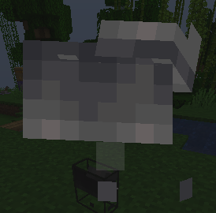

<h1 align="center">Introducing Bean's Backpacks! </h1>

<h3> FYI  </h3>

1.20.1 is the most up-to-date version. 1.20.2 development has been canceled and updates to 
other 1.20 versions are unlikely until a 1.21 version is released. 

Ports to previous versions 
are difficult since trims and the decorated pot were added in 1.20. A simplified version for 1.18.2 is the most likely if any back port does happen.

### Mod Developers
I have added many methods in [CompatHelper](https://github.com/BeansGalaxy/Beans-Backpacks-2/tree/20.1/common/src/main/java/com/beansgalaxy/backpacks/platform/services) to hopefully help you out. I've also added Cancelable Events for both [Forge](https://github.com/BeansGalaxy/Beans-Backpacks-2/blob/3611f372af03a57efae49abbb9c8a4b1d6c4b4c5/forge/src/main/java/com/beansgalaxy/backpacks/platform/ForgeCompatHelper.java#L69) and [Fabric](https://github.com/BeansGalaxy/Beans-Backpacks-2/blob/3611f372af03a57efae49abbb9c8a4b1d6c4b4c5/fabric/src/main/java/com/beansgalaxy/backpacks/platform/FabricCompatHelper.java#L64) if your mod needs to interact with how the backpack is dropped on death.

### Mod Packs

All the mod's config is handled by <b>Data Packs</b>, checkout 
<a href="https://github.com/BeansGalaxy/Beans-Backpacks-2/blob/master/assets/examples/Create%20Your%20Own.md">Creating Your Own</a> 
for how to disable the backslot when wearing an item or blacklisting items from backpack inventories. 
Creating mod packs is what got me into modding so if you have any suggestions for config leave it in 
the issues tab. 

 

<h1 align="center"> Changelog </h1>

### 20.1-2.0

- Added Config Screen
- Removed `beansbackpacks:upgraded_backpack` item
- Fixed Backpack Menu removing the bottom right most slot when full
- Fixed Backpack would separate from Player's back while shifting

### 20.1-0.29-v2

- Double-clicking an item now picks up any matching items in the backpack
- Fixed double-clicking to pick up all items in the backpack menu
- Fixed client crashing from dragging your mouse to split items in the backpack menu
- Fixed equipped backpack was being deleted when shift clicking any empty slot in the inventory
- Fixed "Backpack is already equipped" appearing in the inventory with trinkets installed
- Fixed the backpack becoming hidden when an elytra was equipped with Elytra Slot installed
- Fixed my marriage
- Fixed default config being merged with any edits
- Added new `item_weight_override` common config setting
  - controls how much space an item takes in a backpack inventory

### 20.1-0.28-v2

- Migrated `data/modify` files from Data Packs into Config
  - The data-pack method will continue to work in this version but will be removed soon.
- Added "Backpack Lock" Item. Used on a placed backpack to lock it. Shift RClick your locked backpack to unlock
- Shift Clicking a Backpack Item no longer locks it.
- Capes now display rolled up on top backpacks
- Backpacks now render at a much greater distance
- Added Config option to override the max_stacks of data-driven backpacks such as Gold & Netherite Backpacks
  - `data_driven_overrides`
- Added Config option to disable backpack from being rendered and used by other player on the back
  - `always_disables_back_slot`
- Separated Keybind into in-menu uses & in-world uses
- Added an option to specify the sounds when creating a data-driven backpack.
- Cleaned Up code when rearranging the backpack's menu to *hopefully* prevent crashes when taking items
- Backpack Menu Slots are reorganized each mouse click and not per-frame to *hopefully* prevent crashes when taking items
- Fixed bug causing players not to be able to manually equip backpacks with curios/trinkets
- Fixed crash when sending backpack inventory while a client's player is null
- Lighting in Backpack Menus should be more reliable

### 20.1-0.27-v2

- Finalized All Backpack Sounds
  - Sound for locking backpacks
  - Unique Winged Backpack sound
  - Unique Decorated Pot sounds
  - Unique Ender Backpack Sounds
- Ender Backpacks now play sounds at all linked inventories
- Added Advancement for a player attempting to access your locked backpack
- Removed the Back Slot from being disabled
  - If it had been disabled, it will now not render on your back
  - Winged Backpacks & Elytra still cannot be worn together
- Pick-Block with Pots work again
- Fixed Crash on client while accessing ender inventory
- Fixed items disappearing after stacking over 127
- Fixed empty slot in BP menus not disappearing when inventory is full

### 20.1-0.26-v2

- Backpacks can now be locked by holding them & right-clicking
  - Other players cannot access or equip a locked backpack
  - Holding your hotkey with a locked backpack equipped temporarily unlocks it
  - Ender Backpacks cannot be equipped while locked
- Animation Changes
  - Backpacks do not open slowly if you did not open them
  - *Perfected* Backpack opening animations
  - Added breaking decal to punched backpacks
  - Backpacks now take 3 punches to break
  - Locked Backpacks take 8 punches
- Reworked Ender Backpacks
  - Opening a placed ender backpack visually opens all linked packs
  - Ender Backpacks sends less data more frequently and are more reliable
  - Ender Inventories are now one single inventory instead of many synced inventories
- Fire burns backpacks slower
- Cactus instantly breaks backpacks
- Sounds are now registered in `:common`
- Text appears in the inventory while trying to equip something that's blocked by the Back Slot
- Fixed many leather backpack sounds
- Fixed crash caused by players failing to load other back slots
- Fixed dupe with the crafting result slot & shift key

<h3> 20.1-0.25-v2  </h3>

- Finalized Backpack Tooltip
- Added config to switch between 3 tooltip styles
  - Compact (Default) | Vanilla (Old) | Integrated
- Shift clicking a Backpack while holding a block item places that block
- Fullness Bar on equipped Backpack items will turn Green to Orange on their last stack of space
- Inserting items in a placed Backpack Menu will place that item where you clicked instead of the top of the menu
- Added `/beansmod gamerule lockBackpackNoKey`. Requires holding Action Key to allow other player to access your equipped backpack
- Changing Pots & Cauldrons `max_stacks` in the config to `0` disables all backpack functionality
- All network packages are defined in `:common`
- Fixed Instant Place with a cauldron was placing a Backpack with the equipped cauldron's texture

### 20.1-0.24-v3

- Equipped Backpacks have a new tooltip
  - Made more compat
  - Displays up to 34 unique items
- Placed Backpack Menus may now have 5 rows and display up to 70 different stacks
- Backpacks that cannot be equipped now always display an explanation
- Backpacks displayed on the player's back no longer clips with the chestplate
- Added Compatibility with Elytra Slot
- Solved many grave mods deleting Back Inventory on death
- Fixed Trim Registry throwing errors on startup
- Fixed Creative Mode Back Slot not updating to the server causing de-sync

### 20.1-0.23-v3

- Added Config (Mod Menu & Cloth Config required for Fabric) *([more info](https://github.com/BeansGalaxy/Beans-Backpacks-2/wiki/Configurations#mod-loader-config))*
  - Adjustable Max Stacks for backpacks
  - Pressing the hotkey may place an equipped backpack with no right click
  - Set the defaulted value of all gamerules
  - Adjust the Help Menu visibility
- `/beansmod config` has been renamed to `/beansmod gamerule`
- The gamerule `lockEnderWhenLoggedOff` has been renamed to `lockEnderOffline`
- Added new gamerules *([more info](https://github.com/BeansGalaxy/Beans-Backpacks-2/wiki/Commands#gamerule))*
  - `lockBackpackOffline`
  - `lockBackpackNotOwner`
  - `keepBackSlot`
- Backpack Help menu now has a button to hide the menu until a new tab is discovered
- Added Cancellable Events for both Fabric & Forge modders when the BackSlot tries to drop its contents on death

### 20.1-0.22-v3 & 20.2-0.17-v2

- New Backpack Menu!
  - Number of slots now update depending on the number of items stored
  - Slots now have a transparent background to see where to insert items
  - The rendered backpack has more subtle and sharp movements
- Added colors to the Backpack Help tabs
- The equipped cauldron tooltip now uses bucket and bottle emojis instead of `x` & `+`
- Fixed many cases of Ender Backpack de-sync
- Fixed Backpack being dropped as an item on death in servers with trinkets installed
- Fixed Back Slot updating multiple times each equip

<h3> 20.1-0.21-v2 & 20.2-0.17-v2  </h3>

- All Backpack items now have persistent tooltips unique to their traits
- Cauldrons & Pots now visually show their contents in their tooltips
- Added a Backpack Help button onto inventory screen
  - Clicking it opens pages with how-tos for each major milestone of the mod
  - Each tab unlocks when they become relevant in progression (4 total)
  - Replaces the help tooltip on equipped backpacks.
- Fixed Fabric crashing when rendering fluid in cauldrons
- Fixed JEI tooltips not loading properly

### 20.1-0.20-v3 & 20.2-0.17-v2

- Added Back Slot into creative inventory
- Added `/beansmod give` for metal backpacks with a `backpack_id` *([more info](https://github.com/BeansGalaxy/Beans-Backpacks-2/wiki/Commands#give))*
- Added amethyst button to yellow Leather & Winged Backpack items
- Rewrote backpack renderer
- Tweaked Leather Backpack texture
- Added Trims for [Alex's Caves](https://modrinth.com/mod/alexs-caves) & [Blue Skies](https://modrinth.com/mod/blue-skies) *([Adding Modded Trims](https://github.com/BeansGalaxy/Beans-Backpacks-2/wiki/Configurations#adding-modded-trims))*
- Fixed manually equipping backpacks in the inventory can cause previous back inventory to appear as ghost items
- Fixed Backpacks assuming they're hung if they're close to a block when loaded.
- Fixed picked up items dissapearing with a full inventory after placing backpack using hotkey

### 20.1-0.19-v3 & 20.2-0.17-v2

- Completely rewrote backpack traits *([how-to add custom backpacks](https://github.com/BeansGalaxy/Beans-Backpacks-2/wiki/Custom-Backpacks--20.1%E2%80%900.19%E2%80%90v2))*
- Backpack Items now all have hard coded default traits w/o a `backpack_id`
- Backpack traits identifier `display{key:_}` has now been renamed to `backpack_id`
- Removed dyable backpacks through data
- Adding backpacks through data has been streamlined for more functionality in the future
- Added `fire_resistant` boolean to backpack traits
- Removed `upgraded_backpack`
- Replaced existing Netherite Backpacks with cosmetic Null Backpacks
- Winged backpacks now keep their enchantments when placed
- Updated Winged Backpack recipe to carry over elytra enchantments
- Pots can now store items with nbt
- Hotkey + RClick on Pots and Cauldrons to equip them
- You can now pick up fluid out of placed cauldrons
- Fixed crash when rendering any tooltip with Ender Backpack equipped

With the changes to Backpack traits it is now impossible to change the sizes/disable default backpacks. 
This will be re-introduced in an update soon to add config.

<h3> 20.1-0.18-v2 & 20.2-0.17-v2  </h3>

- Added wearable cauldrons
  - Holds 24 buckets
  - Fluids can be placed/picked-up with hotkey
  - Hotkey + clicking on containers in inventory quickly empties
  - You can carry water, lava, powdered snow, honey, and modded fluids
- Changes to Decorated Pot
  - Limited to 128 stacks
  - Never deletes items if over 108 stacks on death
  - Drops as item on death. Can only be picked up if back slot is empty
  - Only hold items w/o nbt or damage
- Enchanted Books act like they stack to 16 in backpacks 
- Backpacks act like they stack to 16 in backpacks *(you can carry 16 in leather backpacks)*
- Added many new Advancements for new features
  - Re-organized Advancements so many will be lost
- Fixed "Time for an Upgrade" Advancement again

### 20.1-0.17-v3 & 20.2-0.17-v2
- Added many methods for compatibility with other developers. *([You're In Grave Danger](https://modrinth.com/mod/yigd))*
- That's it for now.

### 20.1-0.16-v3 & 20.2-0.17-v2
- With various grave mods installed the backpack will try not to place in the grave on death.
- Fixed elytra item not dropping on death
- Fixed items being deleted while equipping a non-ender backpack
- Fixed crash with some mods in the Key-Bind Menu *(all my homies hate \@Redirect)*

### 20.1-0.15-v2 & 20.2-0.17-v2
- Backpacks now work with comparators. *(including Ender Backpacks)*
- Added final Ender & Winged Backpack texture
- Named Backpacks now display their name & Ender Backpacks display their owner.
- With F3, you can see all placed Ender Backpacks' coordinates.
- Added `/beansmod` command. *([more info](https://github.com/BeansGalaxy/Beans-Backpacks-2/wiki/Commands))*
- Added `config` subcommand.
  - Added an option to unbind worn Ender Backpacks on death.
  - Added an option to lock a player's Ender Backpack while they're offline.
- Added Various `enderdata` commands to help with managing Ender Backpacks entries. 
- Elytra Wings are now visible when Winged Backpacks are hung.
- Added `remove_backpack_keys` to Data-Pack's `modify` *([more info](https://github.com/BeansGalaxy/Beans-Backpacks-2/wiki/Configurations#additional-lists))*
- Added Backpack Items to the Recipe Book.
- Fixed multiple workarounds to `disables_back_slot` & `disable_chestplate`
- Restructured Backpack Entities classes so they are more modular.
- Restructured Ender Data saving and loading.

### 20.1-0.14-v2 & 20.2-0.17-v2
- Added Winged Backpacks
- Added Ender Backpacks *([more info](https://github.com/BeansGalaxy/Beans-Backpacks-2/wiki/Functionality#ender-backpacks))*
- Added `elytra_items` in Data-Pack's `modify` folder *([more info](https://github.com/BeansGalaxy/Beans-Backpacks-2/wiki/Configurations))*
- Renamed *New Duds* Advancement description to *Equip a Dyed Backpack*
- Many changes to Backpack Entities and Inventories

<h3> 20.1-0.13-v2 & 20.2-0.16-v2  </h3>

- Fixed Backpacks disappearing on Death

### 20.1-0.12-v2 & 20.2-0.15-v2
- Added Decorated Pot to Creative Tab
- Added Translation options for Backpack items
- Cleaned up lang file.
- Pick Block in survival now checks the Backpack Inventory
- Fixed Pot was not rendering on players in Forge.

### 20.1-0.11-v2b
- Forge version crashed on launch due to mixin errors

### 20.1-0.11-v2 & 20.2-0.15-v2
- Added Hopper Functionality (visual de-sync issues)
- Item lists in the modify folder of a datapack now supports !namespace:id 
        to override any previous items and remove them.
- Added new advancement gained by moving items with a hopper.
- Using a backpack item on a cauldron clears it's color.
- Simplified the process to add backpack trims. _([How To Add Trims](https://github.com/BeansGalaxy/Beans-Backpacks-2/wiki/Configurations#adding-modded-trims))_
- Placing backpacks now have a little shake animation.
- Fixed unequipping backpacks did not update the renderer.
- Fixed curios/trinkets input slot appearing in creative menu.

### 20.1-0.10-v2 & 20.2-0.14-v2
- Server crashed while trying to access client only classes.

### 20.1-0.9-v2 & 20.2-0.14-v2
- New Pot textures and Updated Model to look closer to a placed pot.
- Elytra functionality only is disabled while [Elytra Slot](https://modrinth.com/mod/elytra-slot/version/6uCj1VmZ) is installed. (Elytra support is always enabled)

### 20.1-0.8-v2 & 20.2-0.13-v2
- Crash when right-clicking an empty slot of a placed backpack (thanks Emery319)
- Items declared in `disables_back_slot` now check all armor, Curio, and Trinket slots and cannot be 
equipped while a backpack is worn, likewise, a backpack cannot be equipped if an item declared is 
already equipped. 
- If `disables_back_slot` stops an item from being equipped, the backpack hit sound plays.
- Create mod's Copper and Netherite Backtanks are included in `disables_back_slot`
- Forge 1.20.1 was not building correctly.
- Pots use a different sound for inserting/taking items.
- Backpacks Feature Renderers are registered through mod loader's 
events, instead of Mixins.
- Fixed Dupe from shift clicking items from result slot.

### 20.1-0.7-v2 & 20.2-0.12-v2
- Hovering over an empty and equipped Decorated Pot shows a help tooltip.
- Added Backpack Action to a new category in the Keybind Menu
- Insert sounds and logic now work consistently.
- Iron and Gold backpacks have had their max stacks reduced to 7 and Netherite reduced to 9
- Removed Elytra functionality when Curios/Trinkets are installed _(Check out [Elytra Slot](https://modrinth.com/mod/elytra-slot/version/6uCj1VmZ))_
- Fixed crash when clicking a specific slot with curios installed.

### 20.1-0.6-v2 & 20.2-0.11-v2
- Increased # of stacked dropped when dying with a Pot to 108 Stacks. (4 Chests)
- Fixed server crash when renaming backpack in an anvil.
- Backpacks will now remember their name when placed, then picked up.
- Replaced unsafe Mixin Redirect responsible for baking item models with mod events.

### 20.1-0.5-v2 & 20.2-0.11-v2
- Binding the Backpack's Action Key to a key on the mouse now instantly places it.
- You can now blacklist items from the Backpack's Inventory using datapacks
- backpacks will now not drop on death if Keep Inventory is set to true.
- Dying with Curios/Trinkets installed would cause backpack to drop as an entity and item.
- The backpack's back slot is now designated as the players first back slot when using Curios/Trinkets
   Thanks to avilonlegends for the keybind suggestions 

<h3> 20.1-0.4-v2 & 20.2-0.10-v2  </h3>

- Re-binding the Backpack's action key now works if bound to sneak/shift
- Added compatibility with jjblock21's Better Smithing Table
- Fixed Crash when trinkets had added more slots.
- Minor bugfixes
 
### 20.1-0.3-v2 & 20.2-0.9-v2
- Fixed Bug where Back Slot was not appearing in the Inventory
- Removed Insert Slot without curios installed.
- You can now place items on top of the equipped backpack to place/take items from its inventory. 
(Use Hotkey + Click in place of Shift Click)
- Decorated Pots now show their inventory in its tooltip while equipped
 
### 20.1-0.2-v2 & 20.2-0.8-v2
- Re-wrote how backpack data is stored on the player
- Simplified the inventory screen controls
- Clicking an equipped backpack in the inventory screen will insert/take items to/from the backpack.
- Punching the backpack if you are not the player that placed it takes one extra hit
- Added compatibility with curios (un-tested with other mods)
- Fixed backpacks dumping error into log if there was no trim
- Fixed when moving items into pots, it would say no key was found in log

### 20.1-0.1-v2 & 20.2-0.7-v2
- Added Unique Sounds for the 3 Levels of Backpacks
- Added Recipes to REI & JEI
- Fixed bug causing no REI/JEI crafting table recipes to load
- Fixed crash when picking up an Item with a full inventory and no backpack equipped

### 20.1-0.0-v2 & 20.2-0.6-v2
- Backpacks now reference their traits from a global list. Updating data pack will update 
backpacks correctly
- Shulker Boxes can no longer be stored in Backpacks
- Added advancement screen (and it looks super cool too)

### 20.2-0.5-v2 
- Fixed looping class when quick moving item from Back Slot inventory using the backpack action key

### 20.2-0.4-v2
- Fixed crash when item was picked up
- Added Backpacks to creative tab
- Added Items to REI/JEI (No recipes)

### 20.2-0.3-v2
- Backpacks are now visible in Smithing Screen
- Leather Backpacks are now more colorful and look closer to their item's color
- Added the option to rebind the key to place Backpacks and move items.
- Hovering over the rebind option explains how it works.
- Empty and equipped Backpacks now display text on how to move items in inventory instead of an 
empty backpack inventory.
- Added a bar on equipped backpacks that display how full its inventory is.
  Big thanks to ApionXD for his suggestions. :)

### 20.2-0.2-v2
- Changing dimensions would de-sync the display inventory of an equipped Backpack
- Returning from the end would delete everything in the Backpack and the Backpack itself (very sorry)
- Forge players couldn't open Backpacks worn on other players
- You could take off your Backpack with items still inside

### 20.2-0.1-v2
- Complete overhaul of the code
- Added support to create custom backpacks through data and resource packs.
- Backpacks placed on snow, slabs, or any other block with unique hitboxes now are placed correctly.
- Retextured placed Gold Backpacks.
- Overhauled how storage on Players and placed Backpacks are handled

