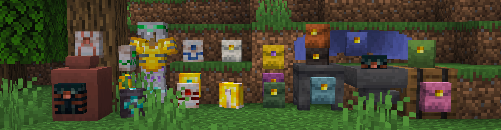
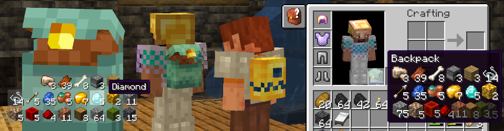
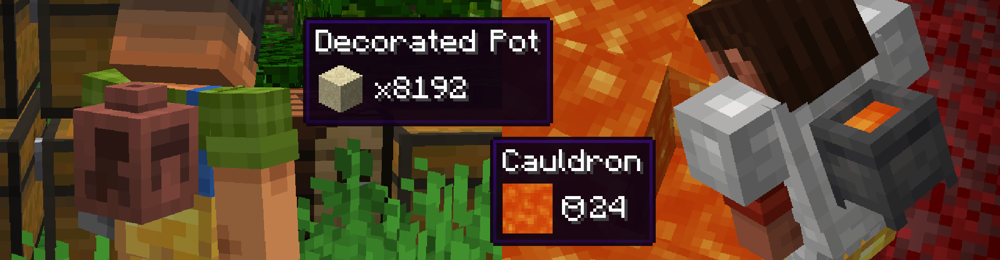
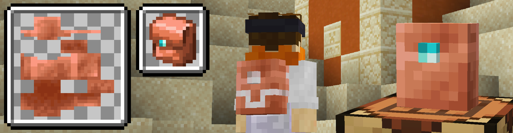

<em><strong>!!!</strong></em> If you are looking for Version 1's Git, you can find it <a href="https://github.com/BeansGalaxy/BeansBackpacks">[here]</a><em><strong> !!!</strong></em>

<h1> Introducing Bean's Backpacks!  </h1>

Babe wake up! A new slot just dropped! Opening your inventory you'll find the
new "Back Slot". After equipping your Backpack, you can store items directly in
it and display it for other players to see. Hold sprint (CTRL by default) + right-click on a block
to place it into the world and to pick it up again.

Storage in these backpacks, similar to bundles, are limited by the total number
of Items. Leather backpacks can hold up to 256 unique items (4 Stacks). Iron
and Gold hold up to 576 items (9 Stacks).

<h2 align="center">Show Your True Colors! </h2>

Leather Backpacks can be dyed any color you can imagine and Iron and Gold Backpacks
can be trimmed with anything you get your hands on.

<h3 align="center"> Crafting / Smithing </h3>

<h2 align="center">Fill 'er up! </h2>

New items are automatically put into the top of the backpack. Hovering over the backpack you
have equipped shows you all the items you have inside. If you need to get the chapstick 
that might've fallen to the bottom, ask your friend to help out and grab it for you. 
Double-check your diamonds after they've been in there though.

<h2 align="center">More Than Meets The Eye! </h2>

The Back Slot is used for more than just Backpacks. Equip a Decorated Pot and 
get unlimited storage of a single item, great for transporting items from a farm 
or quarry! Decorate the pot to show everyone what you're carrying. Sherds made with the
decorated pot display on your back. Tell a story!

<h3> On Death</h3>

Backpacks drop as if you placed them at your feet.
If you are wearing a Pot, all of its items drop on the floor as long as they
stack to 64.

>⚠️ If you die with a pot, items that do not stack to 64 such as Lava Buckets and Ender Pearls will get deleted after spawning 72+ stacks.

<h2 align="center">Looking for More? </h2>

A big feature in Version 2 is that you can add your own backpacks with custom properties by only 
using data and resource packs. Start by downloading the example I have <a href="https://github.com/BeansGalaxy/Beans-Backpacks-2/tree/master/assets/examples"> HERE </a> <---  

<h2> FEEDBACK </h2>
<a href="https://github.com/BeansGalaxy/Beans-Backpacks-2/labels/bug">Report a Bug </a>
&nbsp; • &nbsp;
<a href="https://github.com/BeansGalaxy/Beans-Backpacks-2/labels/compatibility">Compatibility Issues </a>
&nbsp; • &nbsp;
<a href="https://github.com/BeansGalaxy/Beans-Backpacks-2/labels/enhancement">Suggestions </a>

This is my first mod so any feedback is appreciated. You are also free to use this mod
in any modpack, let me know what other mods you use and if there are any compatibility issues.